# Vignan Student Grievance Redressal Agent (Agent 46)

<p align="center">
  <strong>Autonomous, Policy-Driven Student Grievance Redressal & Institutional Governance Intelligence OS</strong><br>
  <em>Engineered for Vignan's Foundation for Science, Technology & Research (VFSTR Deemed to be University)</em><br>
  <em>Integrated AI Hackathon 2026</em>
</p>

<p align="center">
  <a href="https://vignan-student-grievance-agent.onrender.com/"></a>
  <a href="https://vignan-student-grievance-agent.onrender.com/admin.html"></a>
  
  
</p>

<p align="center">
  
  
  
  
  
  
  
  
</p>

<p align="center">
  
  
  
  
  
</p>

---

### 🌐 Live 24/7 Cloud Deployments

| Component | Platform | Live URL | Status |
| :--- | :--- | :--- | :--- |
| **Student Grievance Redressal Portal** | **Render (Production)** | [https://vignan-student-grievance-agent.onrender.com/](https://vignan-student-grievance-agent.onrender.com/) | `● Live (Global)` |
| **Administrative Authority Console** | **Render (Protected)** | [https://vignan-student-grievance-agent.onrender.com/admin.html](https://vignan-student-grievance-agent.onrender.com/admin.html) | `● Live (RBAC Secured)` |
| **Live Health & SLA Watchdog Probe** | **Render API** | [https://vignan-student-grievance-agent.onrender.com/api/health](https://vignan-student-grievance-agent.onrender.com/api/health) | `● 200 OK` |
| **University Multi-Agent Mesh API** | **Render API** | [https://vignan-student-grievance-agent.onrender.com/api/mesh/grievances](https://vignan-student-grievance-agent.onrender.com/api/mesh/grievances) | `● Active (Agents 44/56/57/64/70)` |

---

## Executive Summary & Pitch

**Agent 46** is an autonomous, policy-driven Student Grievance Redressal and Institutional Governance Operating System engineered specifically for **Vignan's Foundation for Science, Technology & Research (VFSTR)**. Developed for the *Integrated AI Hackathon 2026*, Agent 46 transforms bureaucratic, friction-heavy campus complaint procedures into an automated, transparent, and legally binding institutional intelligence loop.

Grounded strictly in the **University Grants Commission (Redressal of Grievances of Students) Regulations 2023**, **AICTE Anti-Ragging Directives**, and the **POSH Act 2013**, Agent 46 delivers:
1. **Dual-Track Intake with Cryptographic Whistleblower Anonymity** (6-digit zero-knowledge PIN for ragging and harassment cases).
2. **Deterministic 3-Tier Statutory Routing** ensuring severe offenses automatically bypass departmental heads directly to statutory bodies (Anti-Ragging Squad, Internal Complaints Committee / Women Protection Cell).
3. **Multi-Carrier WhatsApp Gateway** with instant automated dispatch of formal university acknowledgment receipts.
4. **Autonomous SLA Watchdog Engine** actively computing countdowns, generating real-time administrative alerts, and escalating overdue matters.
5. **Legally Binding University Redressal Orders** bearing dispatch seals, statutory citations, and an enforceable 15-day appellate protocol.
6. **Mandatory Complainant Satisfaction Loop** preventing authorities from unilaterally marking cases closed without student rating and verification.

> **Built by Aasish** | *Integrated AI Hackathon 2026*  
> **Repository:** [aasish3187/vignan-student-grievance-agent](https://github.com/aasish3187/vignan-student-grievance-agent)

---

## The 5 Critical Failure Modes of Legacy Campus Grievance Systems

1. **Fear of Academic Retaliation & Non-Existent Whistleblower Protection**: Students who experience severe harassment or ragging hesitate to speak up because traditional university portals demand registration numbers, department emails, and phone numbers. Physical drop-boxes, conversely, lack tracking, receipt verification, or audit trails.
2. **Bureaucratic Black Holes & SLA Breaches**: Once a complaint is filed in traditional ERP helpdesks or forwarded via email, it enters an unmonitored limbo. Complainants receive no intermediate updates, and cases exceed UGC-mandated resolution periods without penalty.
3. **Siloed Authorities & Disciplinary Inconsistency**: Departments, Deans, and Committees resolve grievances in isolation without access to historical precedents. This leads to arbitrary penalties, subjective bias, and institutional vulnerability during NAAC/UGC regulatory audits.
4. **Linguistic & Accessibility Barriers**: Vernacular-speaking students (e.g., Telugu speakers from rural Andhra Pradesh) struggle to articulate complex legal or disciplinary issues in formal English text boxes, resulting in abandoned submissions or omitted evidence.
5. **Unilateral "Closed" Loopholes (Zero Complainant Accountability)**: Traditional university portals allow an administrator to mark a ticket as "Resolved" without verifying whether the issue was genuinely corrected on campus.

---

## Core Architectural Pillars (With Verified UI Evidence)

```
┌──────────────────────────────────────────────────────────────────────────────────────────────────┐
│                     VIGNAN STUDENT GRIEVANCE REDRESSAL AGENT (AGENT 46)                          │
├──────────────────────────────┬───────────────────────────────┬───────────────────────────────────┤
│ 1. DUAL-TRACK ZERO-KNOWLEDGE │ 2. STATUTORY BYPASS ROUTING   │ 3. MULTI-CARRIER WHATSAPP GATEWAY │
│ Verified vs. Whistleblower   │ UGC/AICTE Direct Routing to   │ Automated Official SMS/WhatsApp   │
│ PIN-Gated Privacy Architecture│ HoD, Dean, Anti-Ragging & ICC │ Dispatch with Tracking Deep Links │
├──────────────────────────────┼───────────────────────────────┼───────────────────────────────────┤
│ 4. PRECEDENT SIMILARITY CORE │ 5. OFFICIAL REDRESSAL ORDERS  │ 6. MANDATORY COMPLAINANT RATING   │
│ AI Benchmarking against Past │ Cryptographic Dispatch Seal & │ Student 1–5 Star Rating Gate      │
│ Institutional Decisions      │ 15-Day Statutory Appeal Rights│ Enforcing Accountability Closure  │
└──────────────────────────────┴───────────────────────────────┴───────────────────────────────────┘
```

---

### Pillar 1: Dual-Track Intake & Cryptographic Whistleblower Anonymity

Agent 46 provides two distinct submission pathways right from the entry portal:
- **Verified Student Track**: Captures Student Name, Registration Number, Department, and Contact details. Provides personalized automated SMS/WhatsApp alerts.
- **Whistleblower / Anonymous Mode**: Completely strips, redacts, and excludes all Personally Identifiable Information (PII) before database persistence. The engine computes a cryptographic **6-digit secret PIN** displayed strictly once. The complainant tracks the case, communicates evidence, reads resolution orders, and rates redressal using only their `Case ID + PIN`.

| Streamlined Intake Portal | Whistleblower Anonymity Toggle | Secret 6-Digit PIN Generation |
| :---: | :---: | :---: |
| 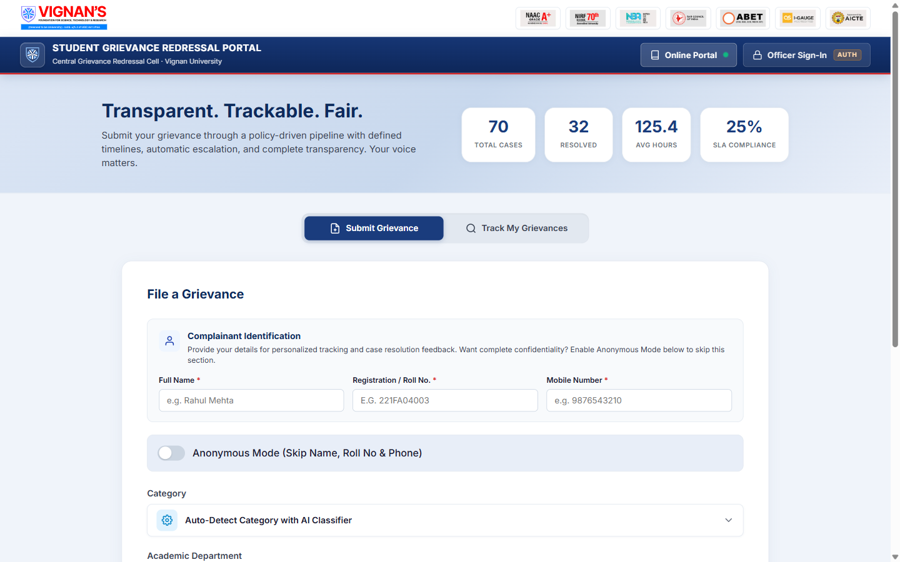 | 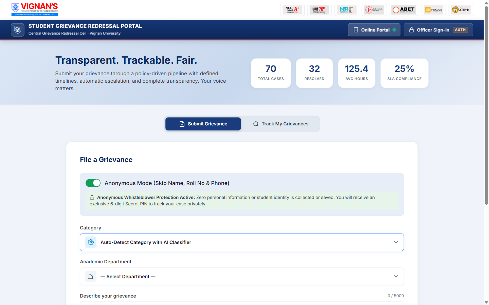 | 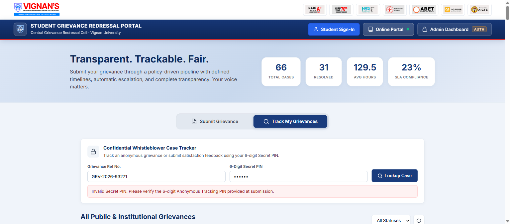 |

---

### Pillar 2: Deterministic 3-Tier Statutory Routing & Anti-Ragging Bypass

Unlike generic chatbots that guess assignments, Agent 46 enforces deterministic regulatory mapping:
- **Department HoD (CSE, ECE, Mechanical, etc.)**: Academic disputes, attendance calculation errors, continuous internal evaluation (CIE) reviews, and departmental faculty friction.
- **Dean of Student Affairs**: Campus-wide infrastructure, hostel amenities, transport, mess hygiene, and cross-departmental concerns.
- **Statutory Committees (Immediate HoD Bypass)**: Severe categories such as *Ragging / Physical Bullying* or *Sexual Harassment / Gender Inequity* **strictly bypass departmental heads**. Under UGC & POSH regulations, these are routed exclusively to the **Anti-Ragging Squad** or **Internal Complaints Committee (ICC)** to prevent local tampering.

| Statutory Authorities Selection & Separation | Confidential Whistleblower Case Dossier |
| :---: | :---: |
| 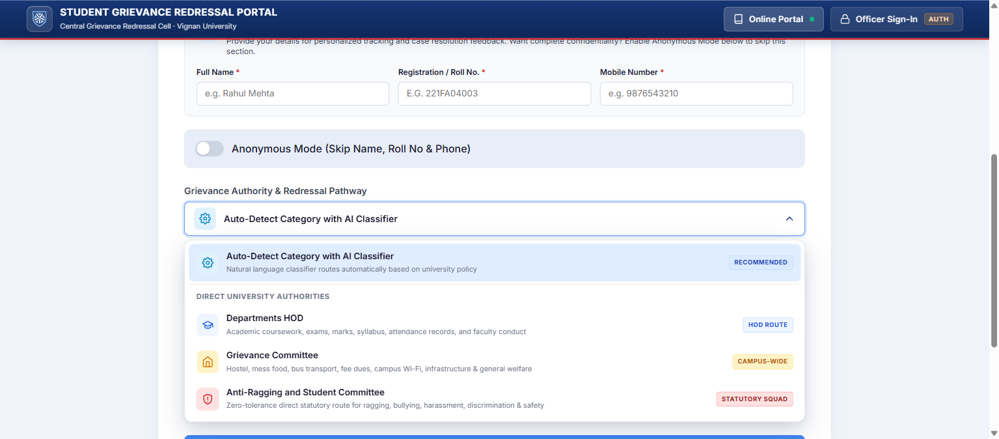 | 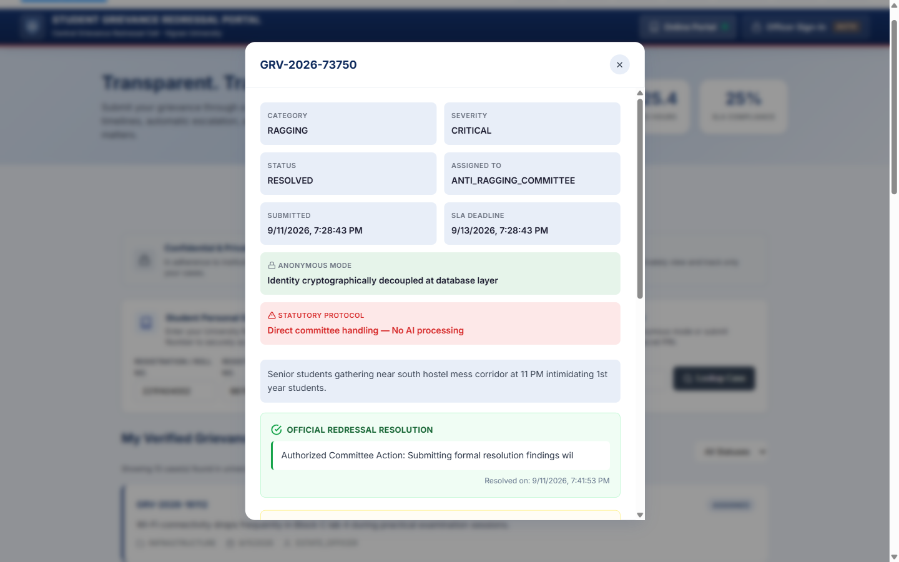 |

---

### Pillar 3: Multi-Carrier WhatsApp & SMS Dispatch Gateway

The moment a verified student submits a grievance, the system constructs a formatted, official University Notice and dispatches it immediately to the student's mobile number:
- Integrates with official university APIs (Twilio Programmable Messaging, Meta WhatsApp Cloud API, and generic HTTP Webhooks).
- Provides instant confirmation with Case ID, Category, Authority in charge, and a direct tracking link.
- Fallback logic safely deflects anonymous complaints to prevent phone number leakage while logging delivery events.

| Instant WhatsApp Dispatch Notification | Administrative Notification Center |
| :---: | :---: |
| 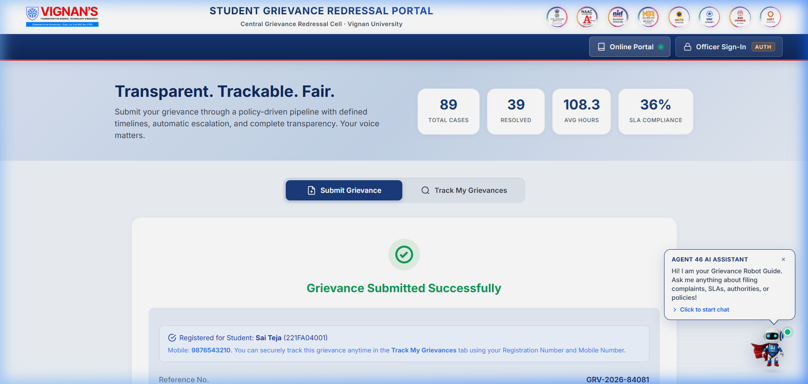 | 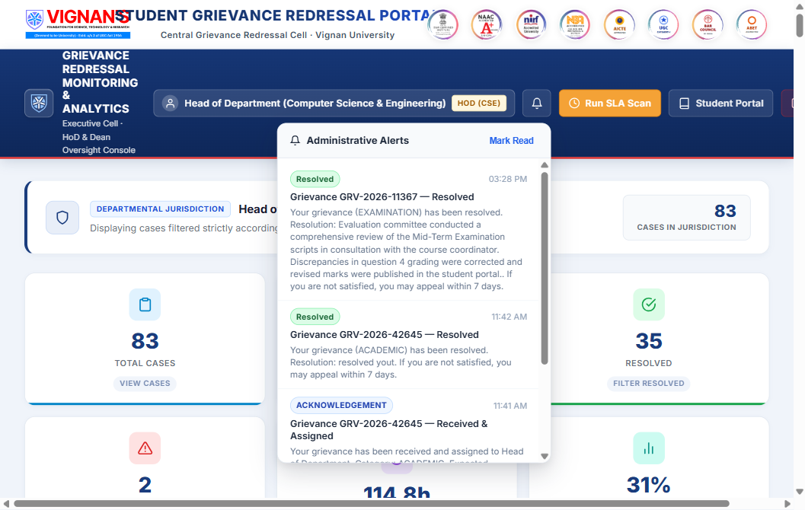 |

---

### Pillar 4: Role-Based Authority Console & Institutional Precedents Engine

Authorities log in through a hardened, credentialed portal (`/admin.html`) partitioned by strict role-based access control (RBAC):
- **HoDs** can inspect only their department's academic grievances.
- **Dean of Student Affairs** oversees campus infrastructure and welfare cases.
- **Committee Chairs** access confidential anti-ragging and gender grievance dossiers.
- **AI Precedent Similarity Engine**: Automatically scans the university repository for analogous past cases, displaying previous disciplinary actions, precedent citations, and recommended resolution templates.

| Hardened Authority Login Portal | HoD Administrative Case Register | HoD Case Dossier with AI Precedents |
| :---: | :---: | :---: |
| 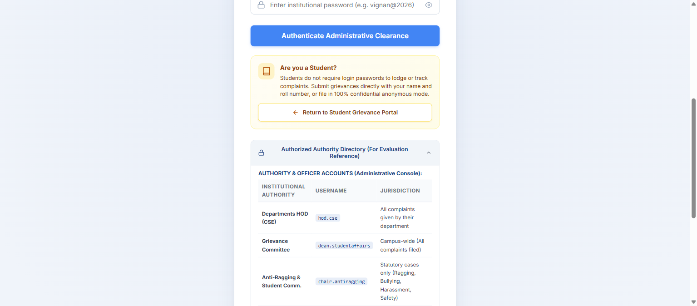 | 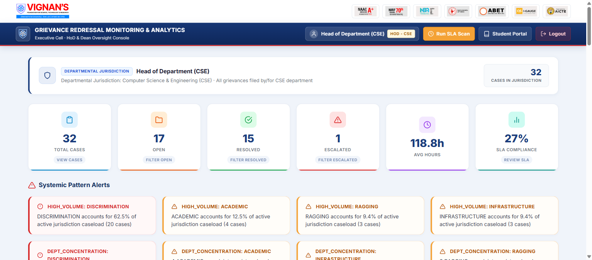 | 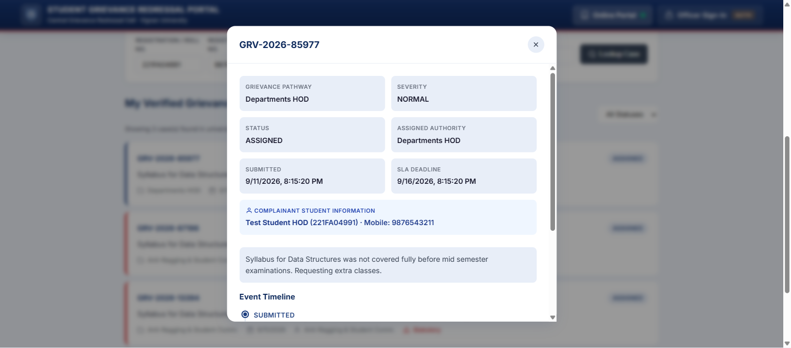 |

---

### Pillar 5: Bilingual Telugu-English Multimodal Voice Dictation

To empower students across rural and semi-urban backgrounds, Agent 46 features integrated **Bilingual Voice Dictation**:
- Real-time speech-to-text supporting **Telugu (`te-IN`)** and **English (`en-IN`)**.
- Built directly into the grievance intake form and case dossier for dictating statements and recording oral witness testimonies.
- Multi-file evidence attachment supporting image previews (`.png`, `.jpg`, `.webp`) and documentary proof (`.pdf`).

<p align="center">
  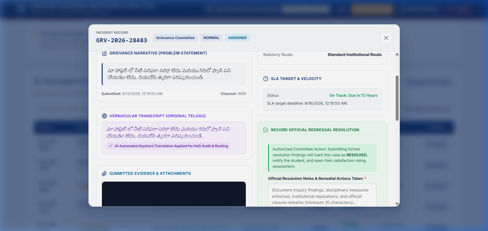
</p>

---

### Pillar 6: Cryptographic University Resolution Orders with 15-Day Appellate Rights

When an authority resolves a grievance, Agent 46 formats and seals an official institutional document:
- **Official Institutional Header**: Bearing VFSTR Crest, NAAC 'A+' seal, and formal university dispatch reference (`VFSTR/GRC/2026/...`).
- **Legal Framework Citations**: Incorporates relevant UGC 2023 statutory clauses.
- **Findings & Directive**: Records the committee's concrete redressal actions and disciplinary findings.
- **Enforceable 15-Day Appellate Right**: Informs the complainant of their statutory right to appeal directly to the **Ombudsperson** within 15 working days if dissatisfied.

| Official University Resolution Order Header | Findings, Signatory Seal & Appellate Clause |
| :---: | :---: |
| 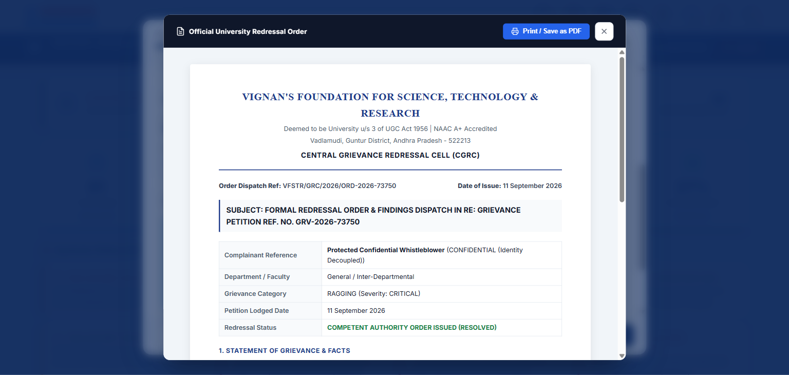 | 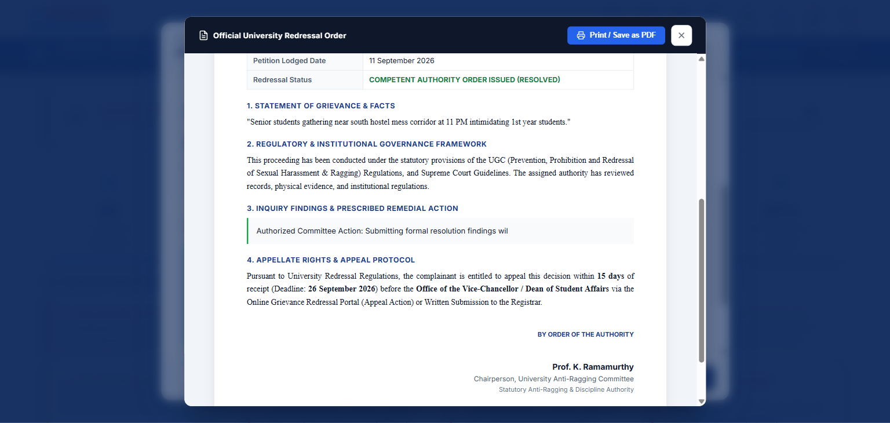 |

---

### Pillar 7: Transparent Real-Time Tracking & Mandatory Complainant Feedback

- **Live Case Tracking**: Real-time status badges (`SUBMITTED` ➔ `ASSIGNED` ➔ `INVESTIGATING` ➔ `RESOLVED` ➔ `CLOSED`).
- **Anti-Unilateral Closure Gate**: When an authority marks a ticket as `RESOLVED`, the case **does not close**. Instead, it triggers a mandatory feedback modal on the student's tracking portal.
- **1–5 Star Rating & Redressal Remarks**: The case is officially marked `CLOSED` only after the complainant submits their satisfaction rating and remarks, instantly updating the administrative metrics.

| Student Case Tracking Timeline | Mandatory Student Feedback & Star Rating |
| :---: | :---: |
| 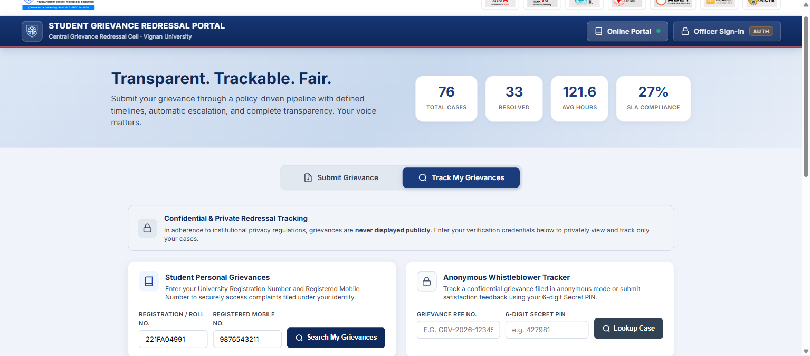 | 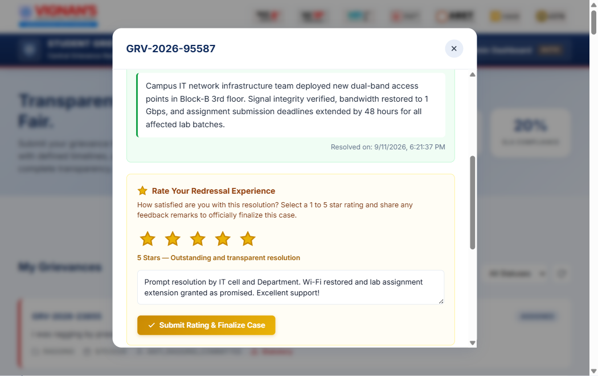 |

---

### Pillar 8: Anti-Abuse 3-Layer Defense Grid

To prevent malicious spamming, automated script flooding, and duplicate filing:
1. **Layer 1: IP Rate Limiting (`src/middleware/rate-limiter.js`)**: Limits each client device/IP to a maximum of 5 submissions per 15 minutes. Excess requests receive HTTP `429 Too Many Requests` with retry headers.
2. **Layer 2: Invisible Honeypot Trap (`honeypotTrap`)**: Features off-screen form inputs invisible to legitimate students. Automated spam bots attempting to crawl and inject form fields trigger silent deflections without entering the database.
3. **Layer 3: Automated Semantic Duplicate Detection**: Checks incoming submissions against existing open/in-progress tickets from the same student/IP in the same category within 48 hours, preventing duplicate queue congestion.

---

### Pillar 9: Interactive Robot AI Policy & SLA Guide

A floating, interactive 3D-styled AI Guide assists students 24/7 directly on the portal:
- Explains institutional grievance policies and escalation hierarchies.
- Clarifies statutory SLA limits (Academic: 7 days, Anti-Ragging: 24 hours, Harassment: 48 hours).
- Guides students on how to use anonymous tracking and secure their secret 6-digit PIN.

<p align="center">
  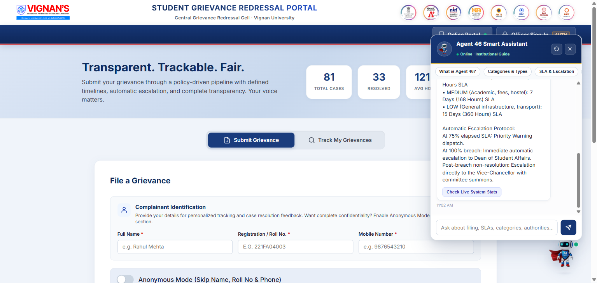
</p>

---

## Visual Architecture & Workflow Diagram

For the complete technical breakdown, see [WORKFLOW.md](./WORKFLOW.md).

<p align="center">
  
</p>

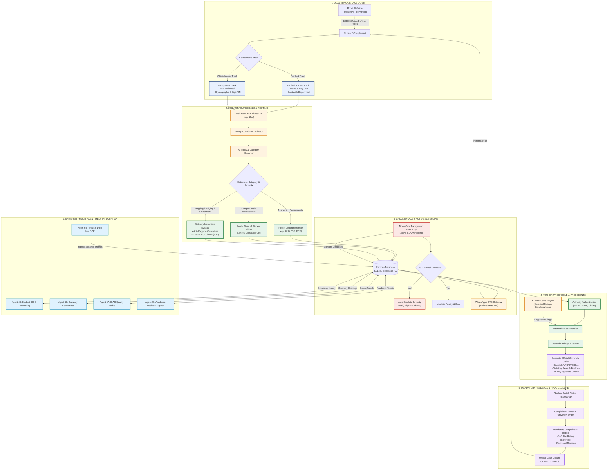

---

## 🥊 Institutional Comparison Matrix

| Dimension / Capability | **Agent 46 (Vignan OS)** 🚀 | **Legacy Paper Drop-Boxes** | **Standard Google Forms** | **Commercial ERP Helpdesks** (ServiceNow / Salesforce) | **Generic Chatbots** (Voiceflow / Botpress) |
| :--- | :---: | :---: | :---: | :---: | :---: |
| **Whistleblower Anonymity** | ✅ **Cryptographic 6-Digit PIN** | ⚠️ Anonymous but zero receipt | ❌ Collects Google Accounts | ⚠️ Requires institutional login | ❌ Session loses state |
| **Statutory Immediate Bypass** | ✅ **Guaranteed (HoD Bypassed)** | ❌ Manual paper sorting | ❌ Flat spreadsheet pile | ⚠️ Complex workflow setup | ❌ Hallucinates routing |
| **Official University Order Generation** | ✅ **Formatted PDF/HTML with Seals** | ❌ None | ❌ None | ⚠️ Generic plain text emails | ❌ None |
| **Mandatory Student Feedback Gate** | ✅ **Enforced 1–5 Star Gate** | ❌ None | ❌ None | ⚠️ Optional survey links | ❌ None |
| **Automated WhatsApp Notifications** | ✅ **Direct Multi-Carrier API** | ❌ None | ❌ Third-party Zapier hacks | ⚠️ Expensive enterprise add-on | ⚠️ Webhook only |
| **AI Precedents Benchmarking** | ✅ **Built-in Semantic Matching** | ❌ Manual filing cabinets | ❌ None | ❌ None | ❌ None |
| **Anti-Abuse Protection Grid** | ✅ **Rate Limiter + Honeypot + Deduplication** | ❌ Paper spam vulnerability | ❌ Vulnerable to bot scripts | ⚠️ Costly enterprise license | ⚠️ Minimal rate limiting |
| **UGC Regulations 2023 Compliance** | ✅ **Native 15-Day Appeal SLA** | ❌ Non-compliant | ❌ Non-compliant | ⚠️ Requires custom coding | ❌ Non-compliant |

---

## Authority Jurisdictions & Default Demo Credentials

| Role | Username | Password | Jurisdiction & Responsibilities |
| :--- | :--- | :--- | :--- |
| **HoD (Computer Science)** | `hod.cse` | `vignan@2026` | CSE departmental grievances, evaluation disputes, faculty friction, lab equipment. |
| **HoD (Electronics & Comm)** | `hod.ece` | `vignan@2026` | ECE departmental cases, project reviews, curriculum scheduling. |
| **Dean of Student Affairs** | `dean.studentaffairs` | `vignan@2026` | Campus infrastructure, hostel amenities, transport, mess hygiene, university events. |
| **Anti-Ragging Committee Chair** | `chair.antiragging` | `vignan@2026` | High-severity ragging, intimidation, physical harassment (Direct Statutory Bypass). |
| **Women Protection Cell / ICC Chair** | `chair.icc` | `vignan@2026` | Sexual harassment, gender discrimination, POSH Act compliance (Confidential). |
| **Registrar & Institutional Admin** | `admin.registrar` | `vignan@2026` | Institutional oversight, inter-agent mesh monitoring, NAAC Criteria 6.2 audit logs. |

---

## University Multi-Agent Mesh Integrations

Agent 46 exposes high-performance REST interfaces for autonomous inter-agent coordination:

```
                  ┌─────────────────────────────────────────────────┐
                  │    Agent 46: Grievance Redressal Agent Core     │
                  └────────────────────────┬────────────────────────┘
                                           │
         ┌──────────────────┬──────────────┴─────┬──────────────────┐
         ▼                  ▼                    ▼                  ▼
┌──────────────────┐ ┌────────────────┐ ┌──────────────────┐ ┌──────────────────┐
│     Agent 44     │ │    Agent 56    │ │     Agent 57     │ │     Agent 64     │
│   Student 360    │ │   Statutory    │ │   IQAC Quality   │ │ Physical Drop-box│
│    Counseling    │ │   Committees   │ │   Audit Feeds    │ │   OCR Ingestion  │
└──────────────────┘ └────────────────┘ └──────────────────┘ └──────────────────┘
```

- **`GET /api/mesh/grievances`**: Comprehensive grievance query feed with filter parameters for department, severity, category, and date range.
- **`GET /api/mesh/grievances/student/:regNumber`** (Agent 44 Integration): Returns historical grievance and emotional stress indicators for personalized student counseling.
- **`GET /api/mesh/grievances/committee/:committeeName`** (Agent 56 Integration): Provides pending hearing dockets and disciplinary evidence for statutory committees.
- **`GET /api/mesh/grievances/iqac/metrics`** (Agent 57 Integration): Outputs aggregated resolution metrics, SLA compliance percentages, and satisfaction indexes for NAAC Criterion 6.2.
- **`POST /api/mesh/grievances/ocr-intake`** (Agent 64 Integration): Ingests OCR scans from physical drop-boxes, automatically routing handwritten grievances into the digital pipeline.

---

## Enterprise Database Architecture (SQLite & Supabase PostgreSQL)

Agent 46 features a **zero-downtime dual-engine architecture**:
1. **Local SQLite Engine (`grievance.db`)**: High-speed, zero-dependency embedded database via `sql.js` with automated disk flushing. Perfect for offline development, local demonstration, and unit testing.
2. **Managed Supabase PostgreSQL (`DATABASE_URL`)**: Enterprise-grade cloud database with connection pooling, ready for **25,000+ campus students**.
3. **Automated Migration & Sync Tool**: Run `npm run db:sync-supabase` to push local records, departments, and audit logs to Supabase in a single command.

---

## Quickstart & Local Development

### Prerequisites
- **Node.js** (v18.0.0 or higher)
- **npm** (v9.0.0 or higher)

### 1. Clone & Install
```bash
# Clone the repository
git clone https://github.com/aasish3187/vignan-student-grievance-agent.git

# Navigate into the project directory
cd vignan-student-grievance-agent

# Install dependencies
npm install
```

### 2. Environment Configuration
Copy the example environment configuration:
```bash
cp .env.example .env
```
Key configuration parameters:
```env
PORT=3000
NODE_ENV=production

# Database (Leave blank for fast embedded SQLite, or supply Supabase URI)
DATABASE_URL=

# WhatsApp Gateway (Twilio / Meta Cloud)
WHATSAPP_ENABLED=true
TWILIO_ACCOUNT_SID=AC_dummy_account_sid_for_demo
TWILIO_AUTH_TOKEN=dummy_auth_token_for_demo
TWILIO_WHATSAPP_NUMBER=+14155238886

# Anti-Abuse Rate Limiting
RATE_LIMIT_WINDOW_MS=900000
RATE_LIMIT_MAX_SUBMISSIONS=5
```

### 3. Launch Application
```bash
npm start
```
The server will start on `http://localhost:3000`.
- Open `http://localhost:3000/` for the **Student Portal**.
- Open `http://localhost:3000/admin.html` for the **Authority Console**.
- Open `http://localhost:3000/api/health` for the **Health & SLA Watchdog Probe**.

---

## REST API Reference

| Endpoint | Method | Access | Purpose |
| :--- | :---: | :---: | :--- |
| `/api/grievances` | `POST` | Public (Rate-Limited) | Submit a new grievance (Verified or Anonymous). |
| `/api/grievances/track` | `POST` | Public | Track case status using `Case ID + PIN/Regd No`. |
| `/api/grievances/track/:trackingId` | `GET` | Public | Retrieve public tracking timeline and order details. |
| `/api/grievances/:id/rate` | `POST` | Complainant | Submit mandatory 1–5 star redressal satisfaction rating. |
| `/api/auth/login` | `POST` | Public | Authority authentication returning scoped JWT. |
| `/api/authority/me` | `GET` | Authority | Get active authority session, role, and jurisdiction. |
| `/api/authority/grievances` | `GET` | Authority | Fetch grievances scoped to authority's jurisdiction. |
| `/api/authority/grievances/:id/resolve`| `POST` | Authority | Submit resolution findings and generate University Order. |
| `/api/authority/grievances/:id/escalate`| `POST`| Authority | Manually escalate case to Higher Appeals Authority. |
| `/api/mesh/grievances` | `GET` | Inter-Agent Mesh | Fetch grievances for inter-agent synchronization. |
| `/api/mesh/grievances/student/:regNo` | `GET` | Agent 44 | Fetch student history for mental wellness & counseling. |
| `/api/mesh/grievances/iqac/metrics` | `GET` | Agent 57 | Fetch institutional compliance metrics for NAAC audits. |
| `/api/health` | `GET` | Public | Health check probe and active SLA monitoring metrics. |

---

## Statutory & Regulatory Citations

Agent 46's governance logic strictly adheres to Indian higher education legal standards:
- **UGC Regulations 2023**: *University Grants Commission (Redressal of Grievances of Students) Regulations, 2023* (Mandatory 15-day appellate timeline to Ombudsperson).
- **AICTE Anti-Ragging Directives**: *Prevention and Prohibition of Ragging in Technical Institutions, Universities including Deemed to be Universities F.No. 37-3/Legal/AICTE/2009*.
- **POSH Act 2013**: *The Sexual Harassment of Women at Workplace (Prevention, Prohibition and Redressal) Act, 2013* (Mandatory confidential ICC proceedings).

---

## License & Attribution

This project is licensed under the **MIT License**.  
Engineered for **Vignan's Foundation for Science, Technology & Research (VFSTR)** for the **Integrated AI Hackathon 2026**.
