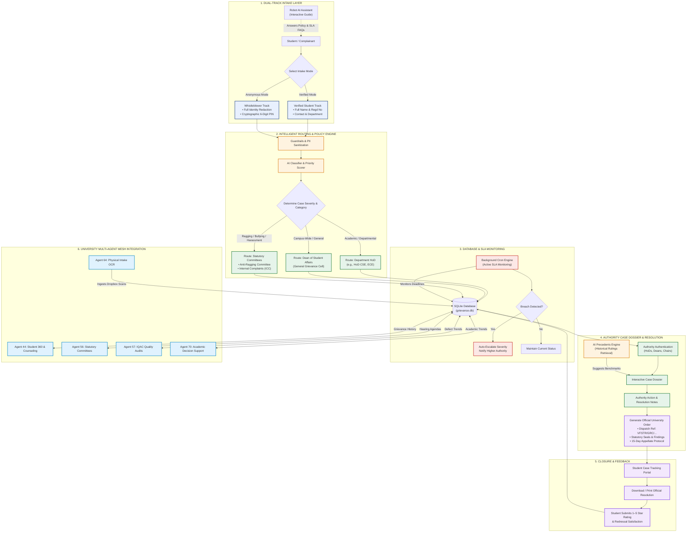

# Agent 46: System Architecture & Workflow

Comprehensive architectural specification and process flow for **Agent 46 (Student Grievance Redressal Agent)** designed for **Vignan's Foundation for Science, Technology & Research (VFSTR)**.

---

## 1. End-to-End Workflow Diagram

---

## 2. Detailed Process Breakdown

### Step 1: Dual-Track Grievance Submission
1. **Verified Student Track**:
   - The student supplies Name, Registration Number, Phone, and Academic Department.
   - Ideal for standard academic, examination, evaluation, and campus infrastructure concerns.
   - Provides live SMS and email status notifications.
2. **Whistleblower / Anonymous Mode**:
   - For sensitive complaints (Ragging, Bullying, Gender Inequity, Retaliation Fears).
   - All PII fields are removed and masked before database insertion.
   - The system generates a cryptographic **6-digit secret PIN** displayed only once to the student.
   - The student uses their Case ID + 6-digit PIN to check status, review resolution letters, and submit feedback without ever revealing their identity.

### Step 2: AI Classification & Statutory Dispatch
- Text passes through the sanitization and keyword affinity engine.
- Assigns severity level:
  - `CRITICAL` (Ragging, Safety Hazards, Harassment) — 24 to 48 hour SLA.
  - `HIGH` (Evaluation disputes, Hostel, Lab access) — 72 hour SLA.
  - `MEDIUM` (Canteen, Transport, Facilities) — 5 to 7 day SLA.
  - `LOW` (General inquiries, Library requests) — 7 to 10 day SLA.
- Routes ticket directly to the appropriate official:
  - **Academic Grievance** -> Respective Department HoD (`hod.cse`, etc.).
  - **General Grievance** -> Dean of Student Affairs (`dean.studentaffairs`).
  - **Statutory Anti-Ragging** -> Anti-Ragging Committee Chair (`chair.antiragging`).
  - **Gender / Sexual Harassment** -> Internal Complaints Committee / Women Protection Cell (`chair.icc`).

### Step 3: Continuous SLA Enforcement
- Embedded background worker runs every minute via `node-cron`.
- Scans `grievances` for upcoming or expired SLA timestamps.
- If SLA is breached:
  - Updates case status to `ESCALATED`.
  - Logs an audit trail event in `grievance_events`.
  - Re-assigns the ticket to the next higher institutional tier (e.g., Department HoD -> Dean -> Vice-Chancellor).

### Step 4: Authority Case Dossier & Precedent Engine
- Authorities access their scoped console (`/login.html` -> `/admin.html`).
- The **AI Precedents Engine** (`/api/grievances/:id/precedents`) searches resolved historical archives in SQLite using term frequency and category matching.
- Displays past rulings, precedent relevance percentage, and historical penalties to ensure fair and consistent institutional action.

### Step 5: Statutory Resolution Order Generation
- When an authority resolves a case, an official **University Resolution Order** is generated (`/api/grievances/:id/resolution-letter`):
  - Official VFSTR institutional header and dispatch code (`VFSTR/GRC/2026/ORD-...`).
  - Regulatory reference (UGC Redressal of Grievances Regulations).
  - Committee findings and mandatory remedial actions.
  - Official 15-day appellate window allowing students to escalate to the Ombudsperson.

### Step 6: Multi-Agent Mesh Integrations
Agent 46 communicates with upstream and downstream institutional agents:
- `GET /api/integrations/agent44/student/:regdNo`: Feeds student grievance history to **Agent 44 (Student 360)**.
- `POST /api/integrations/agent64/digitize`: Ingests OCR drop-box complaints from **Agent 64 (Physical Intake OCR)**.
- `GET /api/integrations/agent56/committee-agenda`: Generates live hearing agendas for **Agent 56 (Statutory Committees)**.
- `GET /api/integrations/agent57/iqac-defects`: Feeds quality defect metrics to **Agent 57 (IQAC Quality Audits)** for NAAC Criteria 6.2 compliance.
- `GET /api/integrations/agent70/academic-decision-support`: Supplies grading dispute trends to **Agent 70 (Academic Decision Support)**.
